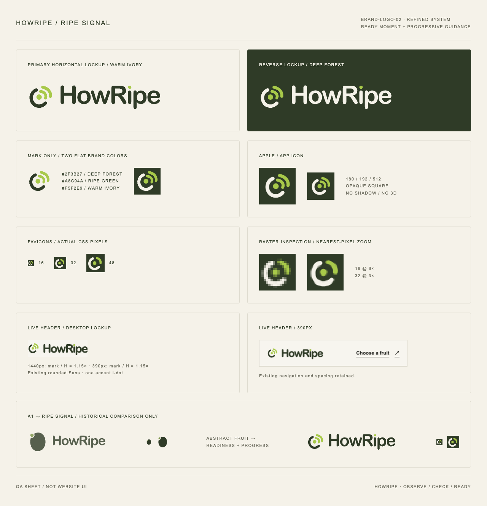
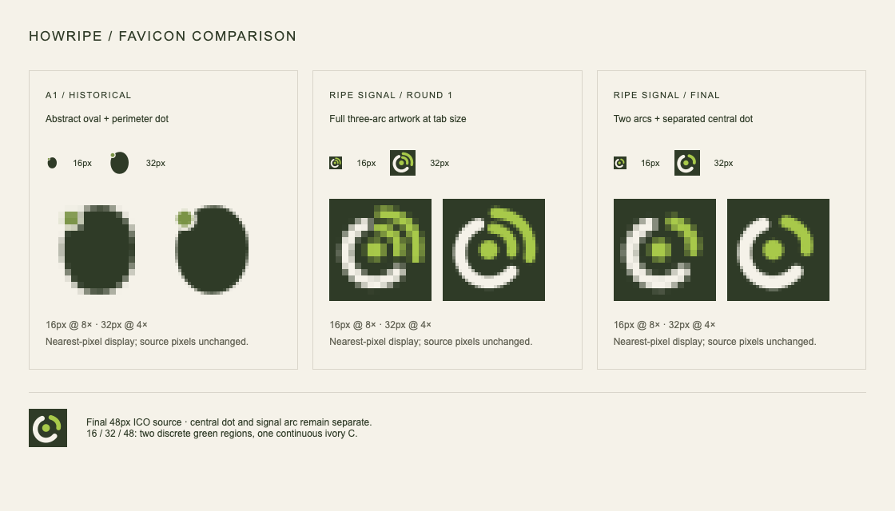

# BRAND-LOGO-02 — Ripe Signal

Date: 2026-10-09. Branch: `feature/brand-logo-ripe-signal`. Started from the clean, exact engineering base `29c58158f7aca5f17e75f911b24b7737de4ba24d` on `feature/brand-logo-a1`. The old A1 implementation was technically validated; its visual design was **not approved**. This task replaces that visual identity while preserving its working integration.

**Local engineering and visual QA: PASS. Final user visual approval: pending.** No main merge or Production deployment is authorized by this task.

## Design and refinement



The old elongated oval was generic and placed the ripeness point at its perimeter. The new original vector mark centers the ripe moment inside an organic, open C-like arc. Two unequal green arcs lead toward the upper-right, suggesting observe → check → ready. Their cubic curves, offset endpoints and unequal lengths avoid a mechanically concentric target or a stock RSS/Wi-Fi construction. No literal fruit, leaf, stem, pit, hand, face, checkmark, clock, texture or gradient is used.

The 72×72 transparent master has a 9.5-unit forest C stroke, 8/8.5-unit green signal strokes and a 7.5-unit central dot radius, all with rounded caps. Primary artwork uses only forest `#2F3B27` and ripe green `#A8C94A`. Warm ivory `#F5F2E9` replaces the forest ink in reverse artwork; the background is transparent. System icons use an opaque forest square with ivory/green artwork and no pre-rounded tile, shadow or 3D effect.

The outlined SVG wordmark reuses the previous rounded Sans glyph paths, with only the i-dot colored green. The website retains live text and its existing rounded display-font stack; no font binary, external font request or dependency is added. Header/footer remain a single continuous “HowRipe” label. A clipped, inherited-font overlay accents only the i-dot without changing the accessible home-link name. The standalone logo's mark ink is about 1.22× capital H; the real desktop and mobile header measurement is **1.152×** ([geometry](final/geometry.json)).

Actual browser iteration was completed:

1. [Round 1](round-1/brand-board.png): central dot and three arcs established the direction, but the two green arcs appeared too parallel and all three arcs crowded the 16px export.
2. [Round 2](round-2/brand-board.png): shortened/staggered the outer signal arc and trialed the compact favicon. The master inner-arc start and compact arc spacing received one further refinement.
3. [Final](final/brand-board.png): separated upper caps, retained the organic C and used a dedicated two-arc favicon. Final header screenshots come from a production build; round-1/round-2 are archived development-render comparisons and may show the development indicator in full-page captures.

These are designer QA judgments; user approval of the final identity remains a separate gate.

## Favicon and asset contract



The compact variant retains the central dot, one strong C-like arc and one short signal arc. It removes the second green arc, increases strokes to 10.5/9.5 units and dot radius to 8, and increases separation. It is exported on an 80-unit forest square. Larger Apple/app icons use the full three-arc master on a 96-unit square. Both variants share the same mark language and palette; there is no separate Google-only identity.

All existing asset URLs are reused:

| Files | Result |
| --- | --- |
| `public/brand/howripe-mark.svg`, `howripe-mark-reverse.svg` | 72×72 transparent primary/reverse Ripe Signal |
| `public/brand/howripe-logo.svg`, `howripe-logo-reverse.svg` | 240×72 outlined horizontal lockups |
| `public/favicon.svg` | Compact square favicon |
| `public/favicon.ico` | Compact 16/32/48px PNG-encoded frames |
| `public/favicon-16x16.png`, `public/favicon-32x32.png` | Compact native raster exports |
| `public/apple-touch-icon.png` | Full mark, opaque 180×180 square |
| `public/icon-192.png`, `public/icon-512.png` | Full mark, opaque manifest/search icon squares |

`node scripts/export-brand-icons.mjs` uses existing Next-bundled Sharp to export all raster/reverse assets. Regeneration is byte-identical ([asset audit](final/asset-audit.json)). Edit both master SVGs together for future geometry changes; the exporter also contains the deliberately simplified favicon geometry. No dependency or build hook changed.

The old oval is absent from production SVG artwork and all public raster assets were regenerated. Old A1 files in `baseline/`, older QA directories and Git history are explicitly **historical comparison evidence**, never production icon sources.

Actual 16/32/48px raster inspection passes ([pixel results](final/favicon-pixels.json)). Each has two disconnected green regions (central dot and short signal arc) and one continuous ivory C. At 16px the dot retains eight strongly green pixels and the C retains 36 ivory pixels; the dot remains visibly separate from the signal. Both actual-size and nearest-pixel enlarged views were inspected. These checks establish raster separation, not a guarantee of subjective brand recognition.

## Integration and frozen scope

`src/components/layout/BrandLink.tsx` continues to serve Header and Footer. Its mark is now square, 30px desktop / 28px mobile; the existing 9px text gap, 44px link target, navigation and layout remain. Header heights remain 77px desktop / 69px mobile including their border. The decorative image retains empty alt, `aria-hidden`, low fetch priority, eager header / lazy footer loading and `unoptimized`. The hero remains the only high-priority image and image preload. The only CSS additions are square mark sizing and the green i-dot treatment.

Root metadata, manifest, icon routing and public filenames are unchanged from A1. There is still one `/favicon.ico` source and no `src/app/favicon.ico` override. The existing 192px `rel=icon`, 192/512 manifest icons and Apple icon resolve to the replaced assets. No JSON-LD was added. Existing social fruit images, canonical URLs, robots, sitemap, routes, English copy, page structure, Quiz, nutrition, sources, internal linking and image-delivery configuration are unchanged. The cumulative tracked application diff is restricted to brand assets, their exporter, shared brand markup and its CSS.

## Automated validation

| Command | Result |
| --- | --- |
| `pnpm test` | PASS — 27 files / 96 tests |
| `pnpm lint` | PASS |
| `pnpm exec tsc --noEmit` | PASS |
| `pnpm build` | PASS — Next.js 16.3.4 webpack production build, existing routes |
| `git diff --check` | PASS |

Existing metadata, manifest, accessibility, ICO-decode, English, SEO, image-priority and Quiz tests remain green. No mirror unit test was added for the visual drawing. The separate pixel QA checks the explicitly required small-size exports.

## Browser QA

Local production Chrome 154: **PASS** for homepage and Avocado at **1440×1000 / 390×844** ([report](local/browser.json)). All four combinations have CLS 0, no horizontal overflow, no console/page errors and no broken visible images. Both Header/Footer marks decode, preserve “HowRipe home” accessible names and return-home navigation. Homepage → Avocado, header-home, Avocado Quiz answer → feedback → Got it, and footer-home flows pass at both widths. One H1, English-only rendered copy, canonical metadata, one critical hero preload and all original sitemap URLs pass.

All 11 public assets return HTTP 200, correct image types and identical repository bytes. Chrome parses the manifest without errors. A disposable Chrome profile verifies the **actual cached 16/32px tab icons** have identical decoded pixels to the exports ([cache report](local/favicon-cache.json)). One initial cache-check run lost its separate Chrome window; a diagnostic isolated rerun and the full QA rerun passed without a product or test change.

Inspected evidence: [desktop home](local/home-1440.png), [phone home](local/home-390.png), [desktop Avocado](local/avocado-1440.png), [phone Avocado](local/avocado-390.png), and per-page Header/Footer screenshots in `local/`. This is controlled Chrome testing, not physical iPhone/Android testing.

Reproduce after `pnpm build` and `pnpm start --port 3108`:

```sh
node docs/qa/brand-logo-02/browser-qa.mjs
node docs/qa/brand-logo-02/brand-board.mjs
node docs/qa/brand-logo-02/favicon-pixels.mjs
```

For protected Preview QA, the existing temporary automation-access wrapper validates project/branch/SHA/environment, provides cookie authentication, and revokes the temporary credential in `finally`. Do not put credentials in commands or reports.

## Git and Preview

Preview deployment and remote QA will be recorded after the application commit is pushed to the existing connected Vercel project. Main and Production remain at `60d2d8b40c9b438e9f35d5417e2097b9828d6c67`; this task stops for user visual approval after Preview verification.

No asset export gaps remain. Google search appearance and existing visitor/browser caches may update only after a later approved Production release and recrawl/cache refresh.
