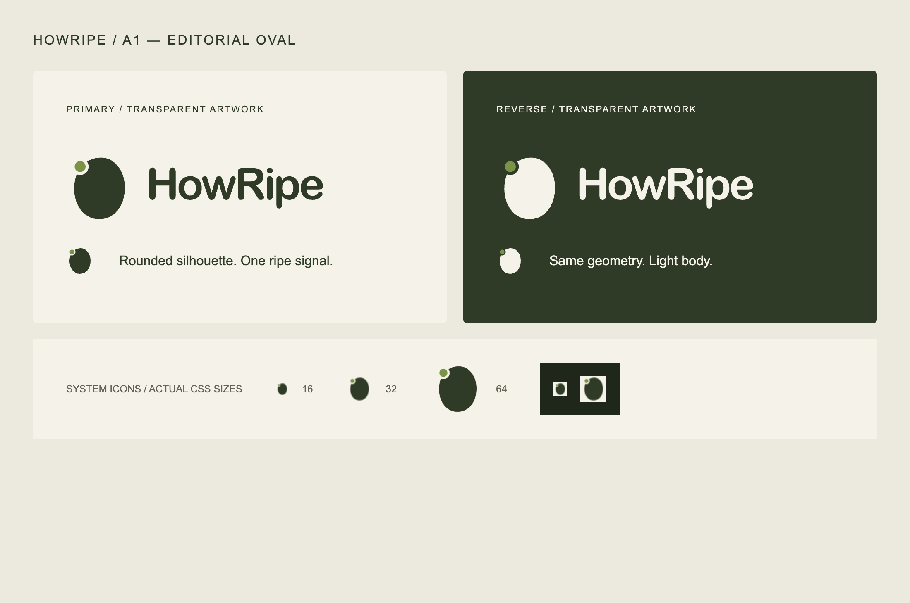

# HowRipe A1 — Editorial Oval

**Historical engineering record. The A1 visual design was not approved.** BRAND-LOGO-02 replaces the public oval artwork with Ripe Signal while retaining the validated integration. See [current identity and QA](../brand-logo-02/README.md). Images and copied assets in this directory are archived comparison evidence.

Date: 2026-10-09. Branch: `feature/brand-logo-a1`. Base: production `main` at `60d2d8b40c9b438e9f35d5417e2097b9828d6c67` (`v1.0.0`).

## Design and assets

The mark is an original asymmetric oval, approximately 51 units wide by 62 high. A small circular ripe signal sits at the upper-left perimeter. Transparent negative space separates the signal from the body, preserving recognition at 16px and avoiding a central pit or fruit cross-section. There are no leaves, stems, faces, checkmarks, texture or gradients. The silhouette does not depict a particular fruit.

Primary ink is `#2F3B27`, the ripe dot is `#7A9346`, and the system-icon background is `#F5F2E9`. The reverse SVGs use the same geometry with a light body/wordmark for dark backgrounds. Website artwork remains transparent, including its negative space. Only system icons carry an opaque square background for contrast on browser and OS surfaces.

The standalone logo has an outlined **HowRipe** wordmark derived from the existing Arial Rounded MT Bold display family (44-unit size, -2.2 tracking), exported with macOS CoreText. It needs no installed font or external font request. The website keeps the existing live-text wordmark and display-font fallback stack for readability and consistency with the fruit pages. No font binary is shipped.

| Asset | Purpose |
| --- | --- |
| `public/brand/howripe-mark.svg` | Transparent 64×72 master mark; header/footer |
| `public/brand/howripe-logo.svg` | Transparent 266×80 outlined mark + wordmark |
| `public/brand/howripe-{mark,logo}-reverse.svg` | Light artwork for dark surfaces |
| `public/favicon.svg` | Square scalable browser icon |
| `public/favicon.ico` | PNG-encoded 16/32/48px ICO frames |
| `public/favicon-16x16.png`, `public/favicon-32x32.png` | Native small browser exports |
| `public/apple-touch-icon.png` | Opaque 180×180 Apple touch icon |
| `public/icon-192.png`, `public/icon-512.png` | Opaque square manifest icons; purpose `any` |

Regenerate system icons and reverse SVGs from the committed SVG masters with `node scripts/export-brand-icons.mjs`. This uses Sharp already bundled with Next.js; no package, lockfile change, external service or build hook is added. It rasterizes from vector artwork at high density and downsamples separately to each target size. Edit both SVG masters together if changing the geometry or wordmark.

## Integration and search foundation

`BrandLink` supplies the shared decorative 32×36 SVG and live **HowRipe** text inside the existing home link. The accessible name stays “HowRipe home”; the decorative image has empty alt text and is hidden from assistive technology. The header loads the tiny SVG eagerly with low fetch priority; the footer loads it lazily. Explicit low priority also prevents React 19's automatic eager-image preload. The original critical hero remains the only image preload. Existing 44px link targets and header/footer layout are retained; the only layout addition is a 9px gap.

Root `metadata.icons` explicitly owns all icon links to stable public URLs. The scaffold `src/app/favicon.ico` is removed so there is only one `/favicon.ico` source and no file-convention override/conflict. `/manifest.webmanifest` is the normal static Next App Router `manifest.ts` convention, automatically linked by Next. It names HowRipe in English, points to 192/512 PNGs, and keeps browser display behavior. No service worker, standalone-mode claim, install prompt or maskable-icon claim is introduced.

The homepage server HTML exposes a crawlable square 192px PNG through `rel="icon"`, alongside browser alternatives. Existing robots allow crawling. This follows the [Google Search favicon guidance](https://developers.google.com/search/docs/appearance/favicon-in-search): use a stable, brand-representative square image, preferably larger than 48px, and allow both homepage and icon crawling. Google supports the supplied PNG/ICO formats; the SVG is a browser alternative. Search appearance and timing remain Google's decision after a production release and recrawl.

No structured data was added: favicon discovery does not require Organization/WebSite JSON-LD. Existing page metadata, social fruit images, JSON-LD, canonical URLs, sitemap and robots strategy are preserved. Fruit copy, Quiz logic, content routes, page structures and image-delivery settings are unchanged.

## Automated validation

All required local gates pass:

| Command | Result |
| --- | --- |
| `pnpm test` | PASS — 27 files, 96 tests |
| `pnpm lint` | PASS |
| `pnpm exec tsc --noEmit` | PASS |
| `pnpm build` | PASS — Next.js 16.3.4 webpack production build |
| `git diff --check` | PASS |

New tests check real metadata-to-file resolution, removal of the conflicting default icon, PNG dimensions, decode all three ICO frames, accessible shared header/footer links and the manifest contract. The first three tests were observed failing before implementation, then passing after integration. A final regression test caught React 19 automatically preloading the eager decorative SVG; it failed before the low-priority fix and passed afterward. Existing English, SEO, image-priority and Quiz regressions remain green.

## Browser QA

`node docs/qa/brand-logo-a1/browser-qa.mjs` runs against a local production server (`pnpm start --port 3108`), or set `QA_ORIGIN`, `QA_OUTPUT` and `QA_PREVIEW=1` for a deployed Preview. Chrome is used through the existing Playwright dependency. The favicon subcheck uses Node 24's built-in SQLite reader and a separate disposable Chrome profile; no personal browser data is accessed. The profile is removed after inspection.

Local Chrome 154: **PASS** for homepage and Avocado at **1440×1000 / 390×844**. Inspected screenshots verify restrained header/footer lockups and no pasted background. Automated checks confirm:

- Both brand links display/decode the same SVG, preserve accessible names and return home.
- All visible images load, there is no horizontal overflow, and no console/page error occurs.
- Each page retains one H1, English-only rendered copy, original canonical and HowRipe social brand.
- Homepage → Avocado → header-home navigation works at both widths; Avocado Quiz answer → feedback → Got it and footer-home work at both widths.
- Each route retains exactly one high-priority hero image and one image preload; the logo adds neither.
- All 11 SVG/PNG/ICO assets respond HTTP 200 with correct image types and byte-for-byte equality to committed files; browser decoding succeeds, and ICO frames decode in unit tests.
- Chrome parses the manifest without errors; robots and the five existing sitemap URLs remain correct.
- Chrome's actual tab-icon database stores **16px and 32px** A1 icons whose decoded pixels exactly match the exported PNGs. This verifies browser adoption beyond inspecting link tags.

Evidence: [local browser report](local/browser.json), [actual Chrome favicon cache](local/favicon-cache.json), [desktop home](local/home-1440.png), [phone home](local/home-390.png), [desktop Avocado](local/avocado-1440.png), [phone Avocado](local/avocado-390.png), and per-page header/footer screenshots in `local/`.

## Vercel Preview

**PASS** on the actual Git-triggered READY Preview for application commit `cca5a3fbe142529edb937dd81e4209c64b8fc064`:

- [Tested immutable Preview](https://fruit-picking-guide-3ogkvi5tm-good-dc6d.vercel.app/)
- [Current branch Preview](https://fruit-picking-guide-git-feature-brand-logo-a1-good-dc6d.vercel.app/)
- Deployment `dpl_5TSJvrecGVgVaBQtGMExrxtke5Cd`; project `fruit-picking-guide`; environment Preview, source Git, exact branch/SHA validated before QA.
- Same four Home/Avocado viewport combinations, header/footer screenshots, image loading, Quiz, navigation, English, canonical/crawl and icon/manifest checks pass remotely.
- All 11 deployed brand/icon assets match repository bytes. The actual isolated Chrome cache again stores matching 16/32px tab icons. There are no console/page errors, horizontal overflow, broken visible images or extra image preloads.
- Temporary automation QA access was created only for this run and revoked in `finally`; the existing Preview protection policy remains intact. Credentials are absent from these reports.

Evidence: [deployment identity](preview/deployment.json), [Preview browser report](preview/browser.json), [actual cached tab icons](preview/favicon-cache.json), [phone home](preview/home-390.png), [desktop Avocado footer](preview/avocado-1440-footer.png) and the remaining per-page/viewport screenshots in `preview/`.

The follow-up evidence commit changes only documentation and QA artifacts; application code/assets remain identical to this tested commit. The existing production deployment remains `dpl_HjuUpUguc1pFiyq6AjqzzWfqMU5M` at the base SHA. No PR, main merge or Production deployment was performed.

No asset export gaps remain. Browser QA is controlled Chrome testing, not a claim of physical iPhone/Android testing.
