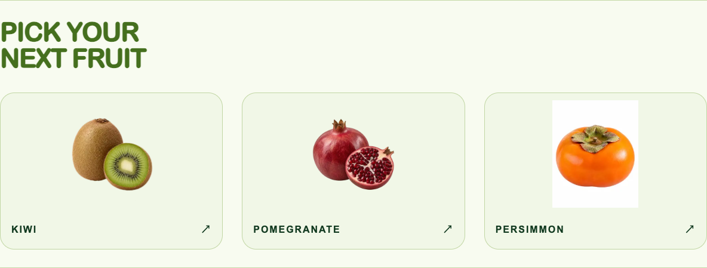
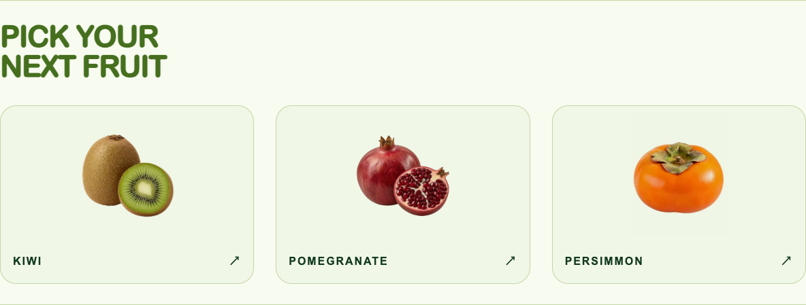
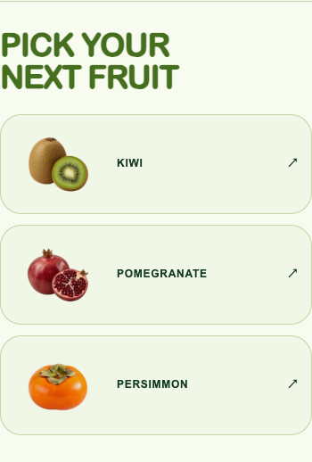

# Related-fruit white background fix

Date: 2026-10-09. Follow-up on `feature/brand-logo-ripe-signal`, based on `9410116d8f0a577652d5c911bdd6301322520ded`. The user reported a white rectangle behind the Persimmon image in Avocado's related-fruit cards.

## Cause and change

The related card correctly reuses `persimmon.hero`, which resolves to the white-canvas Fuyu specimen `/fruits/persimmon/variants/fuyu.webp`. Kiwi, Pomegranate and Persimmon had the existing `mix-blend-mode: multiply` treatment under their `.rollout` theme. Avocado uses the common editorial styling without that theme, so the white canvas remained visible.

Moved that one declaration to the common `.editorial .related-visual` rule and removed the redundant theme-only declaration. All four fruit pages now use the same established treatment. No source-image editing, new asset, dependency, content, route, SEO, brand, layout, sizing, loading-priority or Quiz behavior change.

Before and after:

## Audit and verification

The browser audit covers Home, Avocado, Kiwi, Pomegranate and Persimmon at **1440×1000 / 390×844**, including all five questions of each fruit Quiz at both widths (40 question checks, eight complete quizzes) and related-card navigation. It checks all visible images decode, identifies opaque white source corners with Sharp, and inspects the actual computed blending chain. Deliberate scene photographs are distinguished from isolated specimen art.

The [before report](before/browser.json) fails on exactly one unique route/section/source: Avocado → related → Fuyu. All 33 rendered fruit-image sources were inspected; no other unblended white specimen was found. The [fixed production-build report](local/browser.json) passes with zero remaining cases and zero console/page errors. Pixel checks compare the blank top of the Fuyu canvas with the surrounding card at both sizes:

| Avocado card sample | Before RGB | After RGB |
| --- | --- | --- |
| Fuyu canvas | 254, 254, 254 | 240, 246, 230 |
| Surrounding card | 241, 247, 231 | 241, 247, 231 |

The remaining one-level RGB difference is the original near-white canvas (254) multiplied by the card color, visually continuous. Existing blends on other pages are preserved; transparent art and deliberate scene photographs remain intact. Local screenshots include all related sections, Home and representative Quiz questions. Quiz captures wait for the existing view transition to finish; product animation is unchanged.

Fresh checks: `pnpm test` **27 files / 96 tests PASS**, `pnpm lint` PASS, `pnpm exec tsc --noEmit` PASS, `pnpm build` PASS, `git diff --check` PASS.

Reproduce against a production server on port 3108 with `node docs/qa/image-background-fix/browser-qa.mjs`. `QA_ORIGIN` and `QA_OUTPUT` select a different deployment/output location. The existing Preview-access wrapper validates the exact feature HEAD and revokes temporary QA access afterward.

After pushing this commit, its automatic Vercel Preview passed the same audit. Exact deployment identity and remote results are stored in the sibling `HowRipe-release-reports/image-background-fix/` directory and included in the final response, avoiding another evidence-only deployment. Main and Production remained on the released `60d2d8b` baseline at that checkpoint. The user subsequently approved the overall brand candidate and authorized its [Production release](../brand-logo-02-production/README.md).
